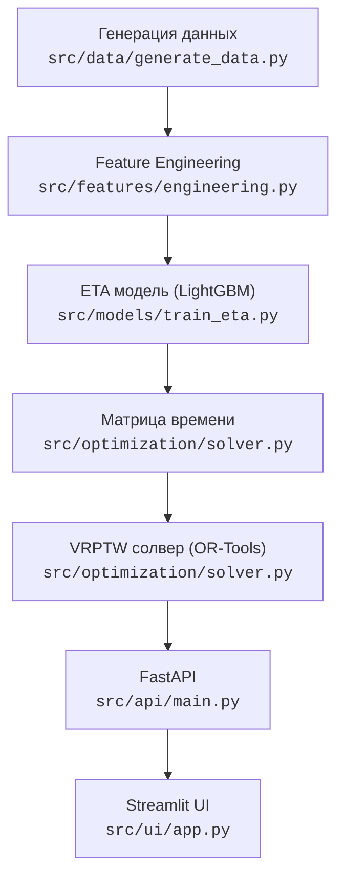

# routeOptimizer

ML-система маршрутизации (VRPTW), прогнозирующая реальное время в пути (ETA) для оптимизации доставки
Обучена на реальных логах поездок **NYC TLC Yellow Taxi (Январь 2023)**.


## Architecture



## Quick Start

```bash
docker-compose up --build
```

## Результаты (120 заказов, 3 курьера)

| baseline_type | MAE (sec) | total_time_sec | served_orders | dropped_orders |
| :--- | :--- | :--- | :--- | :--- |
| **ml** (GLS) | ~150 | 26543 | 77 | 43 |
| **ml** (Greedy) | ~150 | 27843 | 73 | 47 |
| **median** speed | — | 16435 | 90 | 30 |
| **constant** speed | — | 14402 | 95 | 25 |

> **ML vs Baseline:** Базовые эвристики (constant/median) обещают развезти больше заказов (90-95), опираясь на идеализированную скорость по прямой. Модель оценивает время с учетом городского трафика и снижает план до реалистичных 77 заказов, предотвращая массовые опоздания курьеров.
> **GLS vs Greedy:** При использовании одной и той же ML-матрицы алгоритм Guided Local Search превосходит жадный алгоритм, успевая сделать на 4 заказа больше и тратит при этом меньше общего времени на маршрут.

## Структура проекта

```text
.
├── configs/          # конфигурации обучения
├── data/             # сырые/обработанные данные
├── models/           # веса ETA модели
├── scripts/          # скрипты автоматизации
├── src/              
│   ├── api/          # FastAPI эндпоинты
│   ├── data/         # пайплайн данных NYC TLC
│   ├── features/     # генерация признаков (haversine, cyc_time)
│   ├── models/       # LightGBM пайплайн
│   ├── optimization/ # OR-Tools VRPTW солвер
│   └── ui/           # Streamlit дашборд
└── tests/            # pytest
```

## Стек технологий

Python, LightGBM, Google OR-Tools, FastAPI, Streamlit, Pandas, OSMnx, Docker

